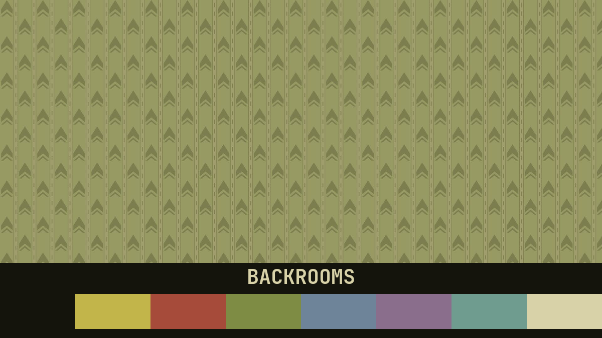
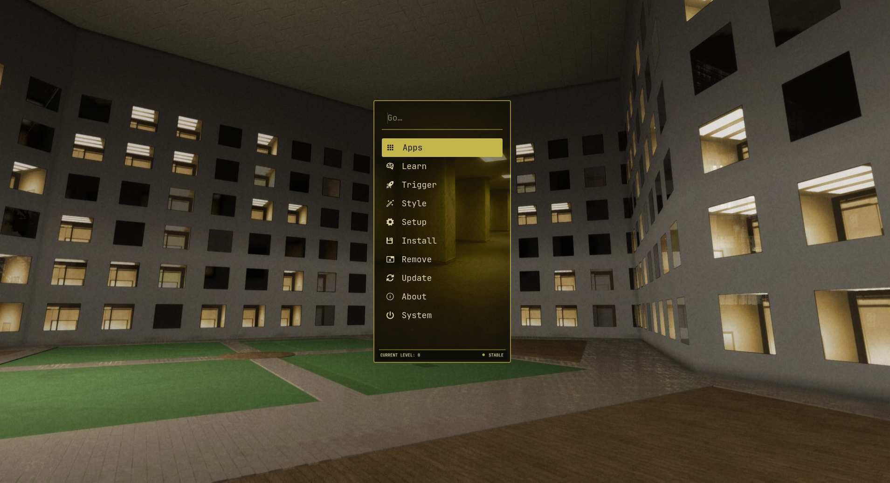
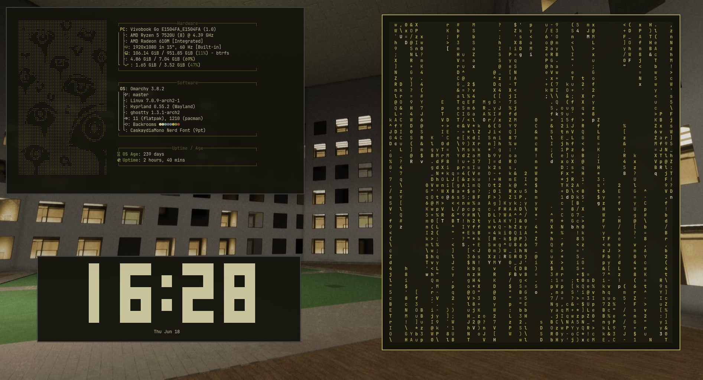
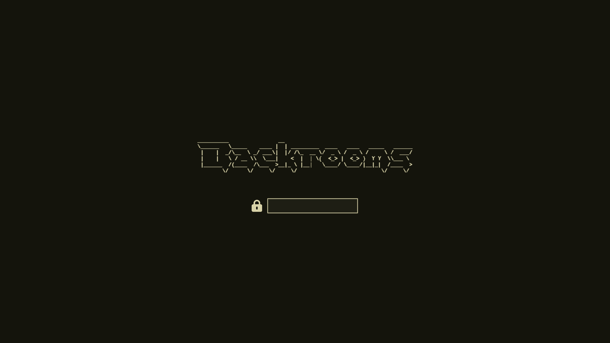

# Omarchy Backrooms Theme

An [Omarchy](https://omarchy.org/) theme inspired by **The Backrooms** — dim olive
black, fluorescent cream, and that dry mustard-yellow wallpaper. You noclipped out
of reality and into your terminal.





## Palette

| Role | Hex | |
|------|-----|--|
| Background | `#14140c` | dark olive black |
| Foreground | `#d8d2a8` | fluorescent cream |
| Accent | `#c2b54a` | dry mustard (the wallpaper) |
| Red | `#a64b3a` | rust |
| Green | `#7e8c44` | mildew olive |
| Slate | `#6e8499` | dim fluorescent blue |

## Install

```bash
omarchy-theme-install https://github.com/cantalusto/omarchy-backrooms-theme
```

Then pick **Backrooms** from the theme menu, or:

```bash
omarchy theme set "Backrooms"
```

## What you get

Everything applies **automatically** when you set the theme — it's built on
Omarchy's color templating, so there's nothing to copy by hand:

- Terminals (Alacritty, Ghostty, Kitty, Foot), Waybar, Mako, GTK, btop, SwayOSD,
  Hyprland borders, Hyprlock, Helix, Chromium, and more
- A custom **Walker** launcher — *Level 0 Terminal*: a dim yellow-room panel, a
  mustard "pill" on the selected entry, and a `CURRENT LEVEL: 0  ● STABLE`
  status strip along the bottom
- Neovim + VS Code use the warm **Gruvbox** scheme (olive/mustard, a perfect match)
- **Yaru-olive** icon theme
- Eight Backrooms wallpapers in `backgrounds/` (the classic yellow wallpaper loads
  as the default)

## Boot / Unlock screen

Apply the boot splash and reboot login via Omarchy's Unlock menu:

> Open the Omarchy menu → **Style → Unlock → Backrooms** (enter your password)

This sets the cream **"Backrooms" ASCII wordmark on dark olive** for both the
Plymouth boot screen and the SDDM login. It survives reboots and `omarchy update`.



## Extras — install manually

These live in `extras/` and aren't part of Omarchy's theme system, so they don't
apply automatically. Each command backs up your current file first.

### System info (fastfetch)

A Braille entity portrait in mustard, keeping all the Omarchy system modules.

```bash
cp ~/.config/fastfetch/config.jsonc ~/.config/fastfetch/config.jsonc.bak
cp ~/.config/omarchy/themes/backrooms/extras/fastfetch/config.jsonc ~/.config/fastfetch/config.jsonc
```

### Shell prompt (Starship)

Powerline segments fading from dry mustard (user) down to olive black (clock).

```bash
cp ~/.config/starship.toml ~/.config/starship.toml.bak
cp ~/.config/omarchy/themes/backrooms/extras/starship.toml ~/.config/starship.toml
```

Open a new terminal to see it.

### Lock screen layout (hyprlock)

A liminal layout: big clock, greeting, rotating phrases ("No-clip.", "Mind the
almond water."…), mustard lock + password field. Pulls its colors from the active
theme and uses the wallpaper as the background.

```bash
cp ~/.config/hypr/hyprlock.conf ~/.config/hypr/hyprlock.conf.bak
cp ~/.config/omarchy/themes/backrooms/extras/hyprlock.conf ~/.config/hypr/hyprlock.conf
```

## Updating

```bash
omarchy theme update     # git pulls every git-installed theme
omarchy theme set "Backrooms"
```

> Don't edit files inside `~/.config/omarchy/themes/backrooms/` directly —
> `omarchy theme update` runs `git pull` and your changes would block it.

**The extras don't auto-update.** If an extra changed upstream, re-run its `cp`
command after updating.

## Wallpapers & credits

"The Backrooms" is community creepypasta lore. The `backgrounds/` images are
Backrooms community art / game screenshots, bundled for personal, non-commercial
use only. If you are a rights holder and want something removed, open an issue.

## License

Theme configuration files are released under the [MIT License](LICENSE).
This licence does **not** cover the bundled wallpapers/artwork (see above).
